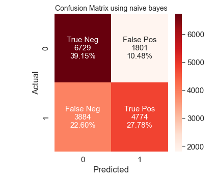
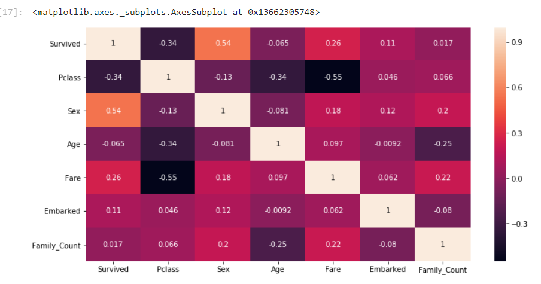
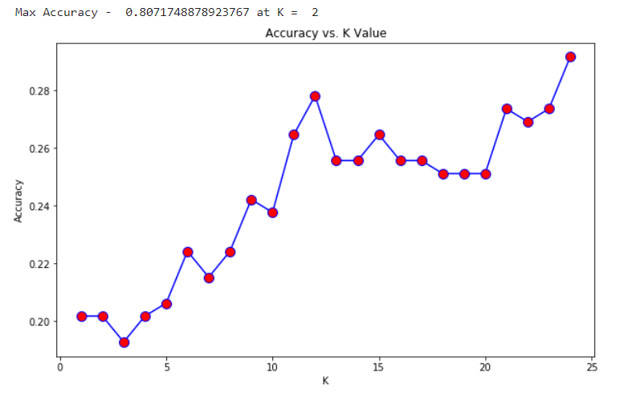
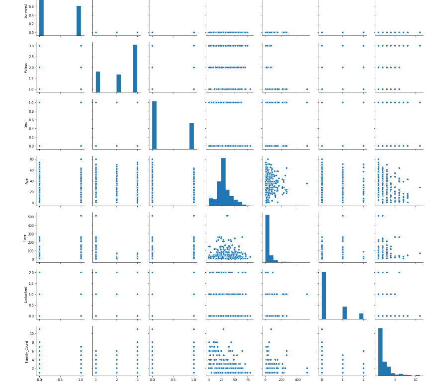

Data Mining - Classification

## Overview
This project presents an in-depth analysis of classification techniques applied to different datasets. The report focuses on Decision Tree (DT), Naïve Bayes (NB), and K-Nearest Neighbors (KNN) algorithms, detailing their implementation, dataset preprocessing, visualization, and performance comparison.

# 1. Decision Tree & Naïve Bayes Classification

### **Introduction**
Decision Tree is a classification technique that uses decision rules to classify data based on attribute values. The splitting criteria used are **GINI impurity** and **Entropy**.

Naïve Bayes is a probabilistic classifier based on **Bayes' theorem**, assuming independence between predictors.

### **Dataset**
The dataset used is **dataset_DT_NB.csv**, which consists of attributes such as ID, Age, Gender, Height, Weight, Blood Pressure (ap_hi, ap_lo), Cholesterol, Glucose levels, Smoking, Alcohol intake, Physical activity, and Cardio disease.

### **Preprocessing Steps**
- Checked for missing values using `isnull` function.
- Converted **Age** to years and computed **BMI** using Height and Weight.
- Transformed categorical attributes like **Cholesterol** and **Glucose** into dummy variables.
- Converted gender values from **1 & 2** to **1 & 0**.
- Split the dataset into **75% training** and **25% testing**.

### **Decision Tree Implementation**
- Built Decision Trees using **GINI impurity** and **Entropy** at different depths (4 & 5).
- Constructed **confusion matrices** for model evaluation.
- Identified the four most influential attributes:
  1. **Systolic Blood Pressure (ap_hi)**
  2. **Age**
  3. **Cholesterol_wellAboveNormal**
  4. **Glucose_wellAboveNormal**

## Screenshots

---

# 2. K-Nearest Neighbors (KNN) Classification

### **Introduction**
K-Nearest Neighbors (KNN) is a **supervised, non-parametric** algorithm used for classification. It predicts class labels based on the **K nearest training points**.

### **Dataset**
The dataset used is **dataset_NN.csv**, which consists of attributes like **Survived, Pclass, Name, Sex, Age, SibSp, Parch, Ticket, Fare, Cabin, and Embarked.**

### **Preprocessing Steps**
- Removed **unnecessary columns** (e.g., Ticket, Name, Cabin).
- Created **Family Count** by merging SibSp and Parch.
- Handled missing values in Age (filled with **median**) and Embarked (filled with **mode**).
- Encoded categorical attributes:
  - **Sex:** Male = 0, Female = 1
  - **Embarked:** S = 0, C = 1, Q = 2
- Identified the **top 3 influential attributes**: **Sex, Survived, and Fare.**

### **KNN Implementation**
- Split the dataset into **75% training** and **25% testing**.
- Used **Elbow Method** to determine the optimal **K value**.
- Built KNN models using different K values (**2, 5, 9**) with **Euclidean distance**.
- Evaluated models using **Confusion Matrix and Classification Reports**.

### **Performance Evaluation**
- Plotted **Error Rate vs. K values** to determine optimal K.
- Plotted **Accuracy vs. K values** for performance comparison.
- Used **Seaborn Pairplot** and **Heatmap** for data visualization.

## Screenshots

